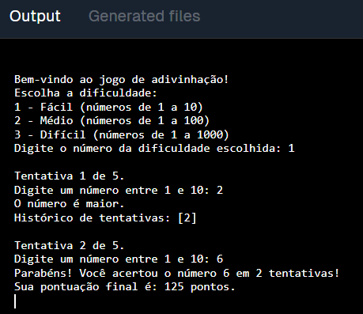

# Jogo de Adivinhação
Bem-vindo ao Jogo de Adivinhação, um jogo interativo no terminal onde você tenta adivinhar um número sorteado, escolhendo entre três níveis de dificuldade. O jogo fornece dicas e mantém um histórico de tentativas para ajudar você!

## Funcionalidades
- Escolha de Dificuldade: Fácil, Médio ou Difícil, variando o intervalo do número e o número de tentativas.
- Pontuação Dinâmica: Começa com 100 pontos e ajusta conforme o desempenho.
- Dicas Inteligentes: Dicas opcionais sobre paridade e múltiplos são oferecidas a cada três tentativas.
- Histórico de Tentativas: Evite repetir números já testados.
## Como Jogar
- Clone o Repositório
- Execute o Jogo
- Siga as Instruções no Terminal:

-- Escolha a dificuldade (Fácil, Médio, Difícil).

-- Tente adivinhar o número sorteado dentro do número máximo de tentativas.

-- Utilize as dicas fornecidas e acompanhe o histórico para melhorar suas chances.

## Regras e Pontuação
- Cada tentativa incorreta reduz sua pontuação em 5 pontos.
- Dicas são fornecidas a cada 3 tentativas.
- Se acertar o número, você ganha pontos extras com base nas tentativas restantes.
  
## Exemplo de Uso

