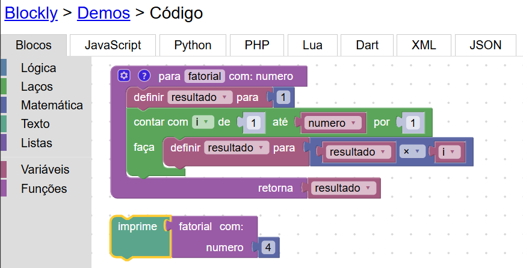
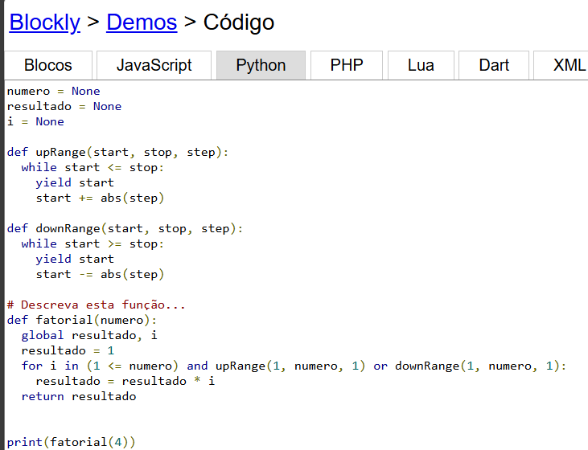
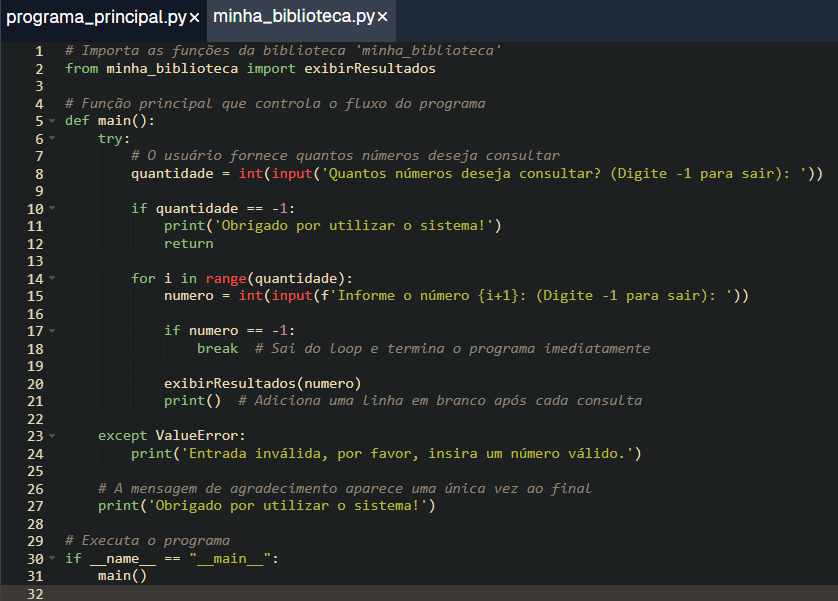
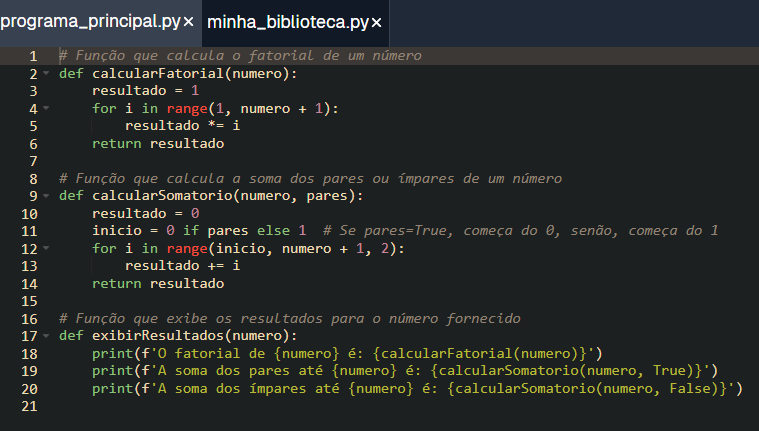
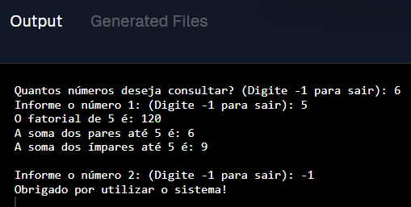

# Uso de Funções e Módulos para Organizar o Código
Inicialmente, criei um projeto básico no Blockly que calculava o fatorial de um número fornecido diretamente no bloco de código. Nesse primeiro projeto, o número não era inserido pelo usuário, mas configurado dentro do próprio bloco. O foco era apenas obter o resultado do fatorial do número especificado no código.

Após esse projeto inicial, desenvolvi uma versão mais avançada do programa no JDoodle, utilizando funções e módulos. O objetivo era modularizar o código, tornando-o mais organizado e facilitando a reutilização. O código foi dividido em duas partes principais:

- Módulo de funções: Contém as funções responsáveis pelos cálculos (fatorial, soma de pares e ímpares) e pela exibição dos resultados.
- Programa principal: Controla o fluxo do programa, solicita a entrada do usuário e exibe as informações calculadas.
# O que o programa faz
O programa solicita ao usuário quantos números ele deseja consultar. Para cada número inserido, ele realiza as seguintes operações:

- Fatorial: Calcula o fatorial do número fornecido.
- Soma dos números pares: Calcula a soma de todos os números pares até o número fornecido.
- Soma dos números ímpares: Calcula a soma de todos os números ímpares até o número fornecido.

A cada consulta, o usuário pode escolher continuar inserindo mais números ou finalizar o programa ao digitar -1. Caso o número fornecido seja válido, o programa exibe os resultados (fatorial, soma dos pares e soma dos ímpares) e adiciona uma linha em branco para facilitar a leitura dos resultados. Ao final, o programa agradece ao usuário com uma mensagem de encerramento.

Essa versão organizada em funções e módulos permite uma maior flexibilidade e clareza no código, além de ser mais fácil de manter e expandir.

Link do projeto básico no Blockly: https://blockly-demo.appspot.com/static/demos/code/index.html?lang=pt-br#afh3pf

Link do projeto oficial no JDoodle: https://www.jdoodle.com/ia/1k02
## Projeto Básico no Blockly: 

## Projeto Oficial no JDoodle:

